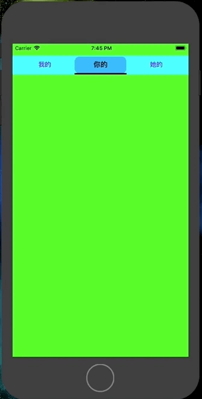
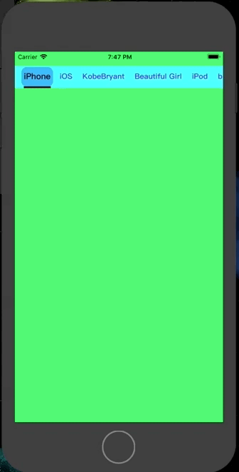
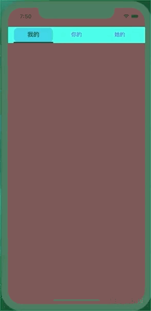
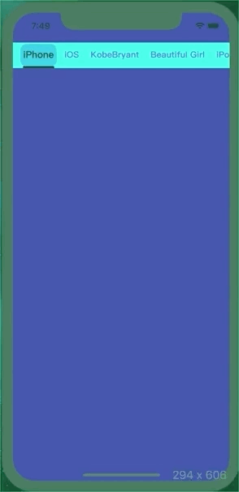

# TabPageView

[](https://travis-ci.org/ShenZhengFang/TabPageView)
[](https://cocoapods.org/pods/TabPageView)
[](https://cocoapods.org/pods/TabPageView)
[](https://cocoapods.org/pods/TabPageView)

The swift version of TabPageView in iOS

- [Example](#example)
- [Requirements](#requirements)
- [Communication](#communication)
- [Installation](#installation)
- [Usage](#usage)
- [License](#license)

## Example

To run the example project, clone the repo, and run `pod install` from the Example directory first.



## Requirements

- iOS 10.0+
- Xcode 9+
- Swift 4.0+

## Communication

- If you **need help**, use [Stack Overflow](http://stackoverflow.com/questions). (Tag 'sftabpage')
- If you'd like to **ask a general question**, use [Stack Overflow](http://stackoverflow.com/questions).
- If you **found a bug**, open an issue.
- If you **have a feature request**, open an issue.
- If you **want to contribute**, submit a pull request.

## Installation

### CocoaPods

TabPageView is available through [CocoaPods](https://cocoapods.org). [CocoaPods](http://cocoapods.org) is a dependency manager for Cocoa projects. You can install it with the following command:

```bash
$ gem install cocoapods
```

To install
it, simply add the following line to your Podfile:

```ruby
source 'https://github.com/CocoaPods/Specs.git'
platform :ios, '10.0'
use_frameworks!

target '<Your Target Name>' do
pod 'TabPageView', '~> 0.0.6'
end

Then, run the following command:

```bash
$ pod install
```

### Manually

If you prefer not to use any of the aforementioned dependency managers, you can integrate TabPageView into your project manually.

## Author

ShenZhengFang, brianbryant@126.com

## Usage

```
import UIKit
import TabPageView

class ViewController: UIViewController {

    override func viewDidLoad() {
        super.viewDidLoad()
        
//        let titles = ["iPhone", "iOS", "KobeBryant", "Beautiful Girl", "UtoVR", "brianbryant", "JustinBieber", "中国", "Taylor Swift"]
        let titles = ["我的", "你的", "她的"]
        
        var childVCs = [UIViewController]()
        for _ in 0..<titles.count {
            let vc = UIViewController()
            vc.view.backgroundColor = UIColor.randomColor()
            childVCs.append(vc)
        }
        
        let style = PageStyle()
        style.isScrollEnable = false
        let tabPageView = TabPageView(frame: self.view.bounds, style: style, titles: titles, childVCs: childVCs, parentVC: self)
        tabPageView.backgroundColor = UIColor.orange
        
        view.addSubview(tabPageView)
        view.backgroundColor = UIColor.red
    }
}
```

## License

TabPageView is available under the MIT license. See the LICENSE file for more info.
